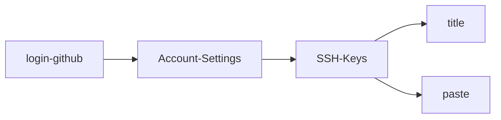

## 1. config your username and email, it just show who u are
```
$ git config --global user.name "Your Name"
$ git config --global user.email "email@example.com"
```
---
## 2. create your repository
```
$ mkdir <dir>
$ git init          //initial your repository,create an empty repository
$ git add <file>    //u may add several files,and commit them together by using the next command
$ git commit -m "message"
```
---
## 3. check your files
```
$ git status   //tell u files modified
$ git diff     //modified what
```
---
## 4. back to special version
```
$ git log   //check your all versions: HEAD is your crrent version
$ git reset --hard HEAD^    // back to the last version :<the last version is :HEAD^，
                            // and last by last is: HEAD^^
                            // on version 100,u can write as: HEAD~100
```						
if u want to go newest version ,u can use:
```
$ git reset --hard <commit id>    
$ git reflog          //find your commit id
```
---
## 5. Undo changes
```
$ git checkout -- file    //just not add file

$ git reset HEAD file     //add file
$ git checkout -- file   
```
---
## 6. delete file
```
$ rm file                  //your workspace delete file

	$ git rm file              //your git hub delete file
	$ git commit -m ""         //done
or
	$ git checkout file         //undo delete
```
---
## 7. remote repository : uploading your local repository

### (1) regist your github account,create SSH Key.
```
$ ssh-keygen -t -rsa -C "yxyyan@yeah.net"     //then press enter all the way,find dir: c:user/yunxu/.ssh/id_rsa  id_rsa.pub
```
### (2) flow


### (3) create new repository->name <anyway> ,then back to your local dir
```
$ git remote add origin https://github.com/yun-xu/road_segmentation.git
$ git push -u origin master
```
---
## 8. branch operate

```
$ git branch                     //check branch
$ git branch <name>              //create branch
$ git checkout <name>            //switch branch
$ git checkout -b <name>         //create and switch branch
$ git merge <name>               //merge the <name> branch to current
$ git branch -d <name>           //delete branch
```
---
## 9. brach visualization
```
$ git log --graph --pretty=oneline --abbrev-commit
```


